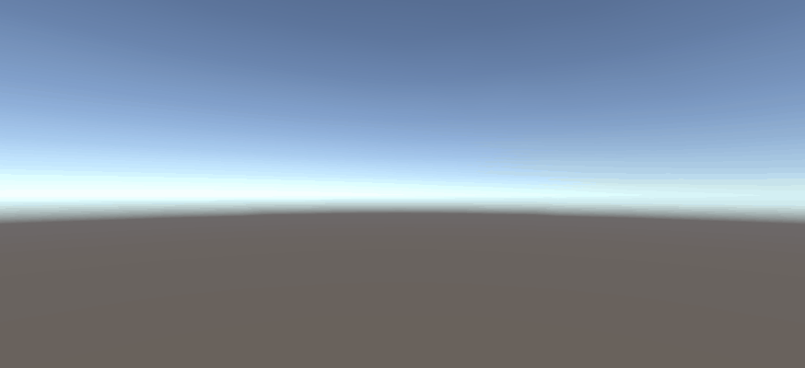

# 简答题
- 游戏对象运动的本质是什么？
    + 游戏对象运动的本质是游戏对象间相对位置的改变。
    ``` C#
    using UnityEngine;
    public class MoveLeft : MonoBehaviour {
        void Update () {
            this.transform.position += Vector3.left * Time.deltaTime; // 相对于世界（绝对）坐标系运动
        }
    }
    ```
- 请用三种方法以上方法，实现物体的抛物线运动。
    + 调用transform属性的方法：
    ``` C#
    using UnityEngine;
    public class Parabola : MonoBehaviour {
        void Update () {
            this.transform.Translate(Vector3.right * Time.deltaTime);
            this.transform.Translate(Vector3.down * Time.deltaTime * (Time.frameCount - 20));
        }
    }
    ```
    + 修改position属性：
    ``` C#
    using UnityEngine;
    public class Parabola : MonoBehaviour {
        void Update () {
            this.transform.position += Vector3.right * Time.deltaTime;
            this.transform.position += Vector3.down * Time.deltaTime * (Time.frameCount - 20);
        }
    }
    ```
    + 利用Vector3的公式：
    ``` C#
    using UnityEngine;
    public class Parabola : MonoBehaviour {
        void Update () {
            transform.position = Vector3.MoveTowards(transform.position, transform.position + (Vector3.right * Time.deltaTime), Time.deltaTime);
            transform.position = Vector3.MoveTowards(transform.position, 
                transform.position + (Vector3.down * Time.deltaTime * (Time.frameCount - 5)), Time.deltaTime * (Time.frameCount - 5));
        }
    }
    ```
- 写一个程序，实现一个完整的太阳系， 其他星球围绕太阳的转速必须不一样，且不在一个法平面上。
``` C#
using UnityEngine;

public class Revolve : MonoBehaviour {

    public GameObject center;
    public float revolveSpeed;

    private Vector3 normalVector;

    private static bool IsParallel(Vector3 lhs, Vector3 rhs)
    {
        float value = Vector3.Dot(lhs.normalized, rhs.normalized);
        return Mathf.Abs(value) == 1;
    }

    void Start () {
        if (revolveSpeed == 0)
        {
            revolveSpeed = Random.Range(20f, 200f);
        }
        while (true)
        {
            Vector3 randomPoint = new Vector3(Random.Range(0f, 1f), Random.Range(0f, 1f), Random.Range(0f, 1f));
            Vector3 vec1 = this.transform.position - center.transform.position;
            Vector3 vec2 = randomPoint - center.transform.position;
            if (!Revolve.IsParallel(vec1, vec2))
            {
                normalVector = Vector3.Cross(vec1, vec2);
                break;
            }
        }
    }
	
	void Update () {
        this.transform.RotateAround(center.transform.position, this.normalVector, this.revolveSpeed * Time.deltaTime);
	}
}
```
只要挂上这个Component，把太阳GameObject拉入属性center中即可。

---

# 牧师与魔鬼

还没做...太复杂了根本做不完  
只创造了些游戏对象


> 更新



代码在[Code文件夹](./Code)中。