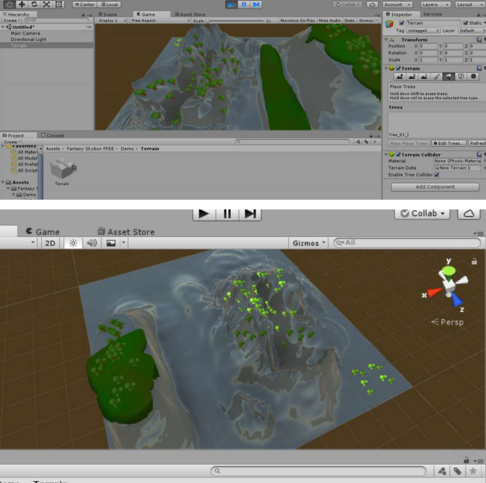
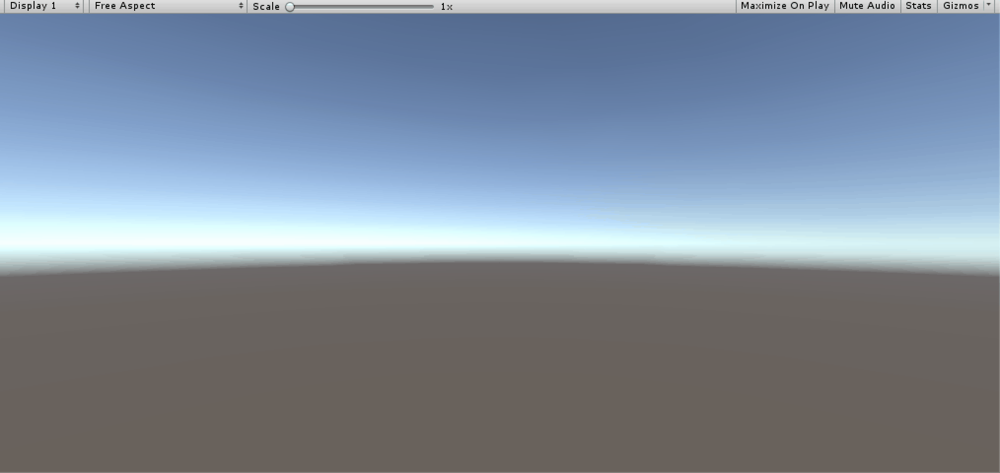

# 操作与总结
- 参考 Fantasy Skybox FREE 构建自己的游戏场景
    +   
    +   开始肯定要先搞好地的大小与高度。
        然后就是建立地形，高山、平原什么的喜欢什么就建什么。等高地形和平缓可以让你的地形更像真实地形。
        然后就是铺草，不然一片蓝色不好看啦，之后种树种花什么的。
        之后还可以加光线啊。
        Asset Store 可以下载资源，素材，自己做不出来好素材还是要找大神！
- 写一个简单的总结，总结游戏对象的使用
    +   游戏对象是描述Unity编辑游戏世界中的任意个体的名称。
    +   我们设计游戏的过程基本就是给游戏对象的集合设计规则并对其进行干预的过程。
    +   我们可以预先创建游戏对象或者动态地在程序执行过程中来加载Prefabs来生成游戏对象。
    +   组件给予游戏对象能力与属性，是对游戏对象的规则添加。

---

# 牧师与魔鬼 动作分离版

代码在[Code文件夹](./Code)中。