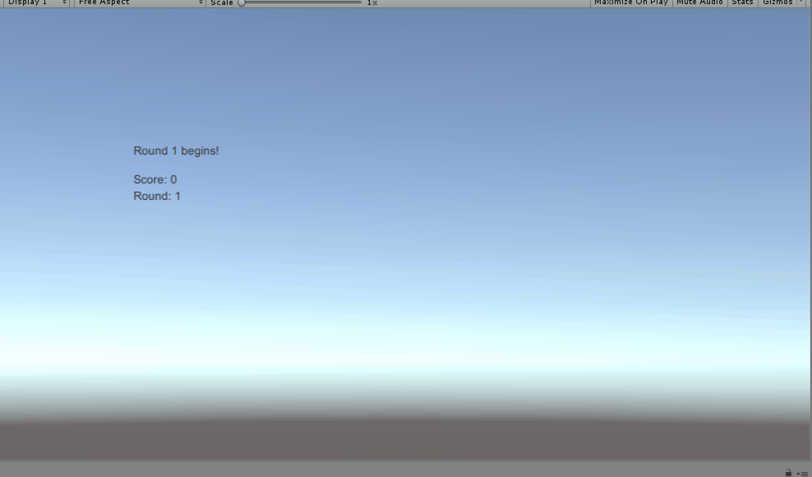

# 打飞碟

代码在[Assets文件夹](./Assets)中。

+ 因为没看懂老师github提供的资源代码的缘故…就没使用了，有点混乱。
+ 规则改为到达一定分数则进入下一关（具体判定在Judge.cs文件里）。
+ 有五条命。
+ 另外没有做第二项Component，它是想让我们做一个飞碟GameObject然后自己写
  Component挂上去实现不同效果的飞碟然后做成Prefabs的意思？没太看懂……
+ 还有我认为GIF图挺好的传视频未免也太麻烦了些…真的不会看广告看到绝望吗。